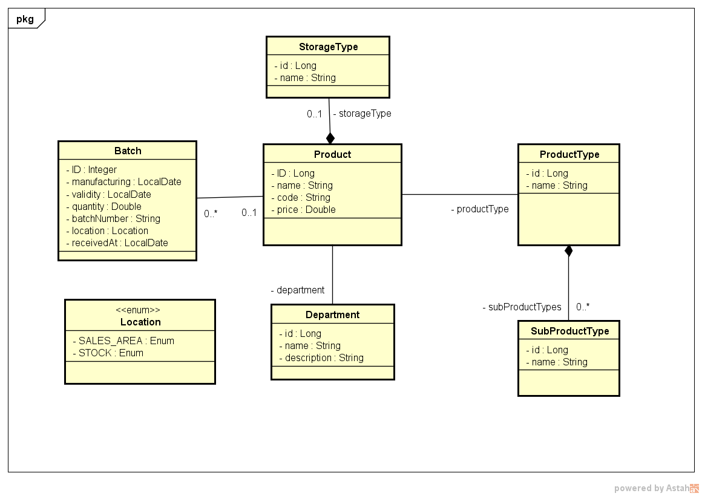

# STOCK CONTROL API

Essa API é dedicada a fazer parte de um sistema de controle de estoque
de produtos. Me inspirei no dia a dia do meu trabalho(sou balconista
de açougue em supermercado). Precisavamos constantemente anotar
datas e quantidade de produtos. Decidi automatizar esse processo.

## Tecnologias

Usei principalmente de Java. Que é a linguagem com a qual mais sou 
familiarizado por estudá-la há anos. A principal tecnologia é o
framework Spring Boot na versão 4.1. Também incluem bibliotecas extras
como o FlyWay para migrations(não sei como eu programava sem ela), e
Testcontainers para testes. Além de muitas outras. Que podem ser vistas
e analisadas no arquivo **pom.xml** na raiz do projeto.

## Contrato da API

Eu usei o **open-api** para implementar o contrato.
pode ser acessado usando o endpoint "**/swagger-ui.html**"

## Modelo de domínio

Fiz esse modelo para me ajudar a organizar e para fazer valer a pena
o livro de UML que comprei. Brincadeiras a parte vou resumir cada classe
brevemente. Essas classes vão se tornar também as entidades do banco
para persistência de dados.

### Product(Produto)

É o produto em si. Alguns exemplos seriam: "Samsung Galaxy 10",
"Coxão Mole Bovino", "Geladeira Electrolux". O ideal é que seja
algo mais específico. Por exemplo, "Celular" se categorizaria mais
como um **Tipo de Produto**(ProductType) Do que o produto em si.

### ProductType(Tipo de Produto)

Pode ser dito como a categoria do produto. Exemplo: "Celular", 
"Eletrodoméstico", "Fruta". Tenha bem em mente o quão concreto vai 
querer que sejam essa categorias.

OBS: Percebi que Category seria um nome melhor para a classe. 
Mas só percebi depois de já tela implementado quase que completamente.
O que tornaria bem trabalhoso a troca de nome.

### SubProductType(Subtipo de Produto)

São tipos mais específicos do tipo de produto. Por exemplo, um 
**tipo de produto**(ProductType) chamado de "Carne" poderia ter subtipos
nomeados de "Suína", "Bovina", "Ave" e por aí vai.

### StorageType(Tipo de Armazenamento)

Classe referente ao local de armazenamento do produto. Alguns são 
Congelados. Outros apenas resfriados e outros secos ou frescos.

### Department(Setor)

Setor onde se encontra o produto. Alguns exemplos são: "Açougue", 
"Frios", "Padaria", "Hortifruti".

### Batch(Lote)

Agora sim a estrela do sistema. O lote é o que próprio nome diz, ele 
é um lote do produto. Ele é a principal ferramenta para rastreamento
de datas, quantidades, validades e localização de produtos.

### Location(Localização)

É apenas um enum(enumeração se preferir) com dois valores. **STOCK** 
indica que ainda não está em exposição para venda, e sim guardado dentro
do estoque ainda. **SALES_AREA** indica que já está exposto apropriadamente 
para venda